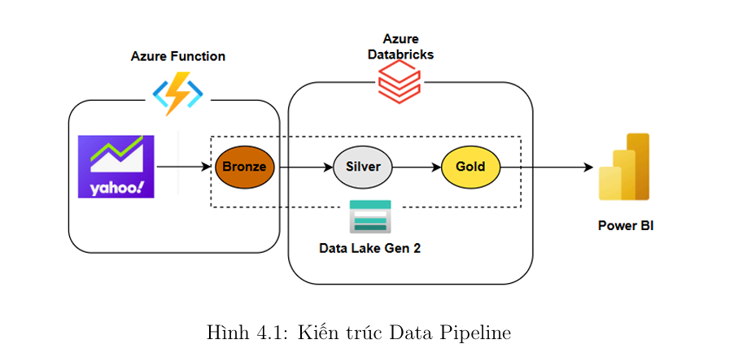
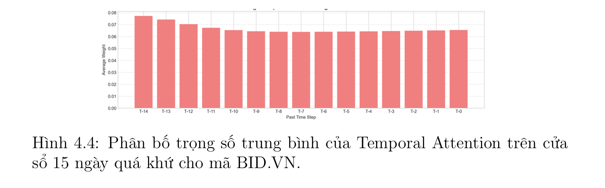
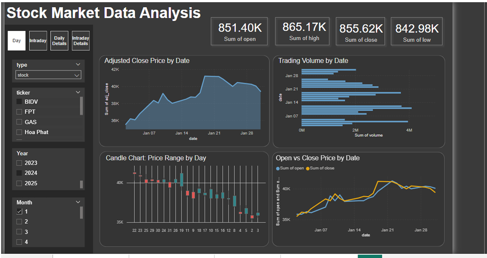
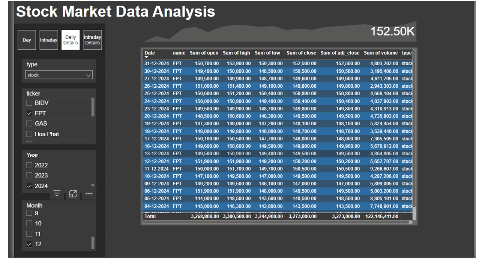

# 📈 Stock Market Intelligence & Forecasting System
**A Data Science Graduation Project focused on Advanced Analytics and Multi-task Deep Learning.**

## 📝 Project Overview
This project delivers an end-to-end analytical solution for the financial market. It integrates automated data collection,  financial data preprocessing (EDA), and a state-of-the-art **MT-DA-RNN** model to forecast price movements and market trends with high interpretability.

- **Analytical Focus:** Bridging the gap between raw data and actionable trading insights.
- **Scope:** 20+ tickers across Vietnamese Stocks (HOSE) and Global Crypto markets.
- **Data Refresh Logic:**
    - **Intraday Data:** Automated transformation every **15 minutes**.
    - **Daily Data:** Automated transformation every **1 hour**.

---

## 🏗 Analytical Infrastructure & Data Refinement
The system utilizes the **Medallion Architecture** on Azure Databricks to ensure high data fidelity for analysis.



- **Layer Silver (Data Cleaning):** Implemented **Forward Fill** logic (using `lag` and `window` functions) to handle missing data points during market gaps, ensuring continuous time-series sequences.
- **Incremental Processing:** Developed a smart update mechanism based on `max(updated)` timestamps to optimize cloud processing for both Day and Intraday streams.
- **Layer Gold (Analytics Ready):** Data is stored in **Delta Tables**, optimized for high-speed querying by Power BI and the Forecasting Model.

---

## 🔍 Detailed EDA & Feature Engineering
To stabilize volatile financial data, I conducted a deep Exploratory Data Analysis (EDA) process:

1. **Stationarity Transformation:** Converted absolute prices into **Percentage Change (% Change)** to stabilize mean and variance, ensuring better convergence for the Deep Learning model.
2. **Technical Enrichment:** Engineered **14+ indicators** including:
   - **Trend:** SMA, EMA, ADX (Measuring direction and strength).
   - **Momentum:** RSI, MACD, Stochastic (Identifying overbought/oversold zones).
   - **Volatility:** Bollinger Bands, ATR (Assessing market risk).

---

## 🧠 Advanced Modeling: MT-DA-RNN with Dual-Stage Attention
I implemented the **Multi-Task Dual-Stage Attention-Based RNN** to solve the complexity of financial forecasting. Unlike "black-box" models, this architecture provides transparency through two mechanisms:

### 1. Input Attention (Feature Importance)
This mechanism identifies which technical indicators are most influential for the current forecast.

*Figure: Analysis revealed that **Lower Bollinger Bands** and **ADX** are key predictors for identifying trend reversals.*

### 2. Temporal Attention (Time Dynamics)
This mechanism identifies which past time steps within a 15-day window are most relevant. 

*Figure: The model successfully captured **long-lag patterns** (high weights at T-14), allowing it to recognize trend inception points rather than just reacting to the latest price.*

### 🚀 Multi-task Learning Results
The model predicts **Price (Regression)** and **Trend (Classification)** simultaneously:
- **Accuracy:** Achieved a **51% reduction in RMSE** compared to standard Stacked LSTM models.
- **Decision Support:** Provides both quantitative price targets and qualitative trend signals.

---

## 🏆 Business Impact & Backtesting
To validate the real-world utility, I built a backtesting engine to evaluate model-driven strategies:

- **Risk Management:** Significant improvement in **Maximum Drawdown (MDD)** compared to "Buy & Hold" (e.g., reducing MDD for BIDV from 27.8% to 22.0%).

---

## 📊 Interactive Power BI Dashboards

### 📍 Market Macro Overview

*Provides a view of market performance, volume trends, and interactive filtering by ticker.*

### 📍 Technical Deep Dive (15-min Intervals)


---


---
**Contact:** [doannhi303@gmail.com](mailto:doannhi303@gmail.com) | [LinkedIn](https://www.linkedin.com/in/nhidoan303)
```